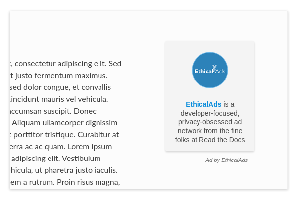

.. All the top-level TOC items are at the H1 level to make the sidebar show them all..
.. I tried with `collapse_navigation` set to False, but it didn't solve anything

EthicalAds Client
-----------------

This is the client library used to add an ad placement from EthicalAds_ to your
site. To get started, you will need to first :ref:`become a publisher <signup>`,
and then you can :ref:`configure your site <Configuration>`.

Usage
-----

There are two pieces required to add an ad placement to your site. You will need
to create an empty ``
`` element where you would like to place a new ad
placement, and you will need to include the client library.

To start, add the following in your site's ``<head>``:

.. code:: html

    

To add the placement on your site, you will need to add an empty ``
`` with
some added data attributes to configure the ad placement:

.. code:: html

    

.. _configuration:

Configuration
-------------

The following data attributes are supported on the ad placement element:

``data-ea-publisher``
    **(Required)** The EthicalAds publisher id for your account.

``data-ea-type``
    The ad placement type. This value can be either ``image`` or ``text`` -- the
    default is ``image``.

``data-ea-keywords`` (optional)
    A pipe (``|``) separated array of keywords for this ad placement.
    This is page-specific (not publisher-specific) keywords related to where the ad is shown.

``data-ea-campaign-types`` (optional)
    A pipe (``|``) separated array of campaign types ("paid", "community", "house").
    This can only further reduce campaign types, not allow ones prohibited for the publisher.
    This is useful when you want certain users to not get certain types of ads.

Themes
------

The following themes are available on all ad placement types:

.. container:: row

    .. container:: left

        **Raised theme**

        This is the default theme used if you do not specify a theme.

        .. code:: html

            

        Or you can also explicitly use the theme name:

        .. code:: html

            

    .. container:: right

        .. example::
            :ad_type: image
            :classes: raised

.. container:: row

    .. container:: left

        **Flat theme**

        .. code:: html

            

    .. container:: right

        .. example::
            :ad_type: image
            :classes: flat

.. container:: row

    .. container:: left

        **Bordered theme**

        .. code:: html

            

    .. container:: right

        .. example::
            :ad_type: image
            :classes: bordered

There are also dark variants for all of the themes. The dark variants can be
used with the ``dark`` class:

.. code:: html

    

.. container:: row dark

    .. container:: column

        .. example::
            :ad_type: image
            :classes: dark raised

    .. container:: column

        .. example::
            :ad_type: image
            :classes: dark flat

    .. container:: column

        .. example::
            :ad_type: image
            :classes: dark bordered

Ad Types
--------

Image placement
~~~~~~~~~~~~~~~

The image ad placement type has two variants: horizontal and veritcal. Vertical
image placements are the default ad type. To use the horizontal variant, use

**Vertical image**

.. code:: html

    

.. container:: row

    .. container:: column

        .. example::
            :ad_type: image
            :classes: raised

    .. container:: dark column

        .. example::
            :ad_type: image
            :classes: dark raised

**Horizontal image**

This variant can be used with the ``horizontal`` theme variant class:

.. code:: html

    

.. container:: row

    .. container:: column

        .. example::
            :ad_type: image
            :classes: horizontal raised

    .. container:: dark column

        .. example::
            :ad_type: image
            :classes: dark horizontal raised

Text placement
~~~~~~~~~~~~~~

Text placements can be defined using ``data-ea-type="text"``:

.. code:: html

    

.. example::
    :ad_type: text
    :classes: raised

.. container:: row dark

    .. example::
        :ad_type: text
        :classes: dark raised

.. _signup:

Ad placement tracking
---------------------

EthicalAds allows you to track all the different ad placements that you have on your site.
This means that if you have an ad on your homepage template,
blog listing template,
and blog post template you can track them all seperately.

This is enabled by adding an ``id`` to the ``ethicalads div`` on your site:

.. code:: html

    

This feature is disabled by default,
you can go to :guilabel:`Settings > Record placements` to enable this feature.

.. tip:: We recommend that you provide an ``id`` for each of your different ad placements.
         This will enable you to track the performance of each placement,
         and make adjustments that increase your :abbr:`CTR (click-through rate)`.

Customization
-------------

It's possible to extend the ad client, even if you are loading the client in
your browser through a request. After loading the script, there will be an
``ethicalads`` global/window instance that can be used to extend the ad client
interface.

The easiest place to extend is the ``ethicalads.wait`` promise instance. This
resolves to an array of placements that were successfully configured -- if no
placements were loaded successfully, this will be an empty array.

The ``ethicalads`` object needs to be instantiated first. If you aren't loading
the ad client library asynchronously, you can delay execution by loading your
additional script after loading the ad client.

If you are loading the ad client library asynchronously, you should wait for a
document ready event. For example, using jQuery:

.. code:: javascript

    $(document).ready(() => {
      ethicalads.wait.then((placements) => {
        console.log('Ads are loaded');
      });
    });

Showing content when there isn't an ad
~~~~~~~~~~~~~~~~~~~~~~~~~~~~~~~~~~~~~~

The biggest use-case is to show backup content when we don't have an ad to show.
Many of our publishers prefer to serve EthicalAds,
but while we're still building the network we might not have a 100% fill rate.

You can show backup content with a code snippet like this:

.. code:: html

  
  

.. warning:: You need to have ``Allow house campaigns`` disabled in the ads dashboard, otherwise we will always return a house ad. Go to :guilabel:`Settings > Control advertiser campaign types` to disable it.

Becoming a Publisher
--------------------

Visit `EthicalAds`_ to apply to be a publisher.

.. _`EthicalAds`: https://ethicalads.io
